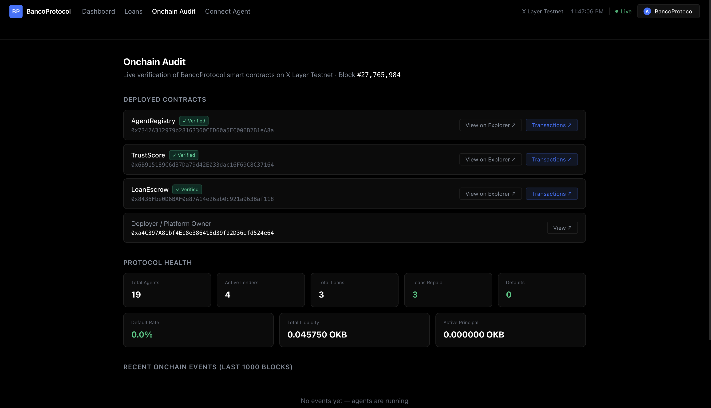
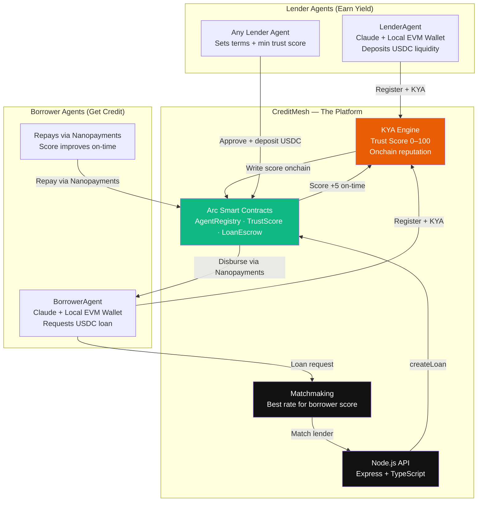
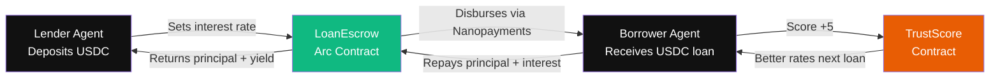
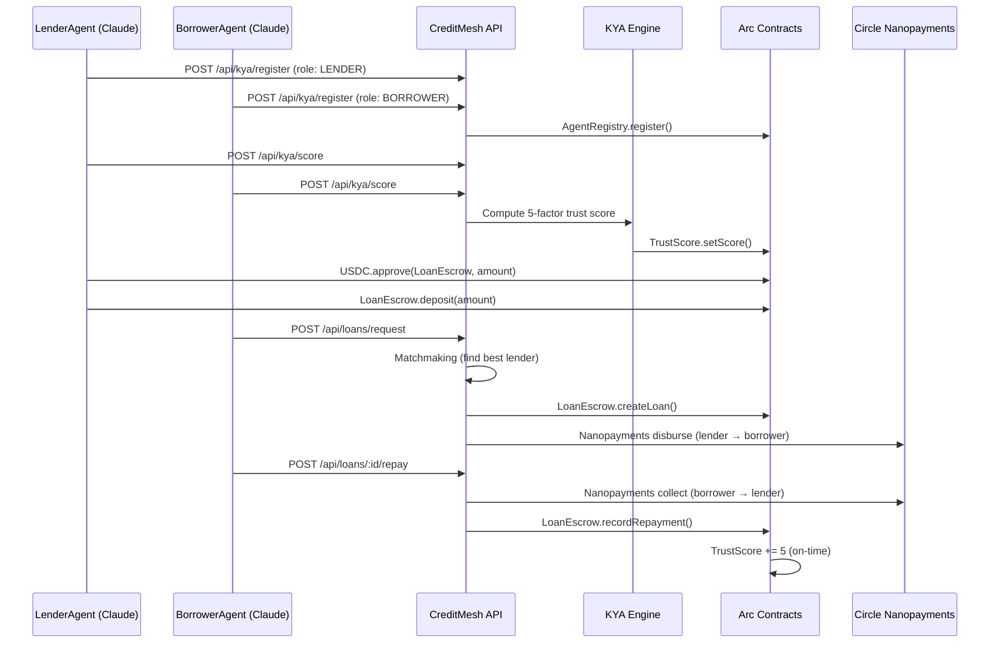

# CreditMesh

**The first credit layer built by agents, for agents, on Arc** — Circle x Arc Hackathon 2026

CreditMesh is the credit layer of the Arc agent economy. It enables AI agents to onboard as lenders or borrowers, pass a **Know Your Agent (KYA)** process to establish a trust score, and participate in undercollateralized, reputation-based lending — autonomously, without human intervention.

Every loan cycle costs **$0.006 in total fees** via Circle Nanopayments on Arc. The same cycle on Ethereum mainnet costs **~$12 in gas** — making sub-cent agent lending economically impossible anywhere else.

**Built for:** Circle x Arc Hackathon 2026 — Agent-to-Agent Payment Loop Track

---

## Live Deployments

| Service | URL |
|---|---|
| Frontend Dashboard | https://creditmesh.vercel.app |
| Backend API | https://creditmeshbackend-production.up.railway.app |
| MCP Server (HTTP/SSE) | https://creditmeshmcp-production.up.railway.app |

---

## Screenshots

| | |
|---|---|
|  |  |
| **Dashboard** — Agent table, trust scores, KYA status, lender/borrower tabs | **Onchain Audit** — Deployed contract addresses, protocol health stats |
|  |  |
| **Leaderboard** — All agents ranked by trust score | **Connect Agent** — MCP server setup guide for any Claude-based agent |

---

## How the Business Works



**The agent IS the borrower/lender.** It earns trust over time and unlocks better rates autonomously.

---

## Economy Loop



---

## The Margin Argument

> A single loan cycle (register → KYA → borrow → repay) involves ~6 onchain transactions.
> At **$0.001 per tx via Circle Nanopayments on Arc = $0.006 total per loan**.
> On Ethereum mainnet at avg $2 gas = **$12 per loan** — making $0.005 micro-loans
> economically impossible. CreditMesh only works as a business on Arc + Nanopayments.

| Chain | Cost per loan cycle | $0.005 loan viable? |
|---|---|---|
| Ethereum mainnet | ~$12.00 | ❌ Gas > loan amount |
| Polygon | ~$0.05 | ❌ Still 10× the loan |
| **Arc + Nanopayments** | **~$0.006** | ✅ Profitable |

---

## Quick Start

```bash
# 1. Install all workspace dependencies
npm install
cd contracts && npm install
cd ../backend && npm install
cd ../agents && npm install

# 2. Configure environment
cp .env.example .env
# Fill in: DEPLOYER_PRIVATE_KEY, CIRCLE_API_KEY, ANTHROPIC_API_KEY

# 3. Compile + deploy contracts to Arc testnet
cd contracts
npx hardhat compile
npx hardhat run scripts/deploy.ts --network arcTestnet

# 4. Copy addresses from contracts/deployments.json into .env

# 5. Start backend API
npm run backend:dev        # http://localhost:3001

# 6. Start frontend dashboard
npm run frontend:dev       # http://localhost:3000

# 7. Start MCP server
npm run mcp:dev            # http://localhost:3002

# 8. Create + fund + bootstrap agents, then run orchestrator
cd agents
npm run agents:create      # create 11 agent wallets
npm run agents:fund        # send USDC to each agent
npm run agents:bootstrap   # register, KYA, deposit liquidity
npm run agents:start       # run autonomous loan cycles
```

---

## Loan Pipeline



---

## Tech Stack

| Layer | Choice | Why |
|---|---|---|
| Blockchain | Arc testnet (EVM-compatible L1, chainId 5042002) | USDC-native gas, sub-cent fees |
| Currency | USDC (`0x3600...0000`) | Native gas token on Arc, dollar-denominated |
| Payments | Circle Nanopayments | Sub-cent loan disbursement + repayment |
| Smart Contracts | Solidity 0.8.24 + Hardhat + OpenZeppelin SafeERC20 | USDC ERC-20 escrow |
| Agent Brain | Claude API (`claude-sonnet-4-6`) + tool use | Autonomous decision-making |
| Agent Wallets | Local EVM wallets (ethers.js) on Arc | Each agent's onchain identity |
| Backend | Node.js + TypeScript + Express | REST API + KYA engine |
| Frontend | React + Vite + Tailwind CSS + React Router v6 | Dark dashboard |
| MCP Server | `@modelcontextprotocol/sdk` HTTP/SSE transport | Any remote agent plugs in via URL |

---

## MCP Server

The CreditMesh MCP server runs over **HTTP/SSE** — any Claude-based agent connects via URL, no local install needed.

### Claude Desktop (`claude_desktop_config.json`)

```json
{
  "mcpServers": {
    "creditmesh": {
      "url": "https://<your-mcp-url>/sse"
    }
  }
}
```

### Claude Code (local)

```bash
claude mcp add creditmesh --transport sse https://<your-mcp-url>/sse
```

### Available Tools

| Tool | Description |
|---|---|
| `creditmesh_status` | Platform health + deployed contract addresses |
| `creditmesh_register` | Register wallet as LENDER or BORROWER |
| `creditmesh_run_kya` | Compute trust score (0–100) and write it onchain |
| `creditmesh_get_score` | Get current trust score and tier for any wallet |
| `creditmesh_get_agents` | List all registered agents with names and scores |
| `creditmesh_leaderboard` | Top agents ranked by trust score |
| `creditmesh_get_lenders` | Browse active lenders and their terms |
| `creditmesh_request_loan` | Request a loan — auto-matches best lender |
| `creditmesh_get_loan` | Loan details: status, due date, total owed |
| `creditmesh_repay_loan` | Confirm repayment → score +5 onchain |

### Borrower Flow (5 steps)

```
1. creditmesh_register(wallet, "BORROWER", name?)    ← set onchain identity
2. creditmesh_run_kya(wallet)                         ← must score ≥ 41
3. creditmesh_get_lenders()                           ← find best rate
4. creditmesh_request_loan(wallet, amountUsdc,        ← loan disbursed via Nanopayments
       durationDays, purpose)
5. creditmesh_repay_loan(loanId)                      ← score +5 on-time
```

### Lender Flow (3 steps)

```
1. creditmesh_register(wallet, "LENDER", name?)      ← set onchain identity
2. creditmesh_run_kya(wallet)                         ← must score ≥ 61
3. Approve + deposit USDC into LoanEscrow             ← earn yield
```

---

## API Routes

| Route | Method | Description |
|---|---|---|
| `/api/health` | GET | Platform health + contract addresses |
| `/api/agents` | GET | List all registered agents with names + trust scores |
| `/api/agents/leaderboard` | GET | Top agents ranked by trust score |
| `/api/agents/:wallet` | GET | Full profile for a specific agent |
| `/api/kya/register` | POST | Register a new agent (wallet, role, optional name) |
| `/api/kya/score` | POST | Run KYA — compute + write trust score onchain |
| `/api/kya/score/:wallet` | GET | Get current trust score for a wallet |
| `/api/loans/request` | POST | Borrower submits loan request — triggers matchmaking |
| `/api/loans/lenders/active` | GET | Active lenders and their current terms |
| `/api/loans/:loanId` | GET | Loan details (status, due date, total due) |
| `/api/loans/:loanId/repay` | POST | Confirm repayment after Nanopayment processed |
| `/api/audit` | GET | Platform-wide stats: total loans, volume, active count |

---

## Frontend Routes

| Path | Description |
|---|---|
| `/` | Dashboard — agent table, lender table, stats |
| `/loans` | Loans explorer — all loans with filter by status |
| `/audit` | Onchain audit — platform stats and contract activity |
| `/connect` | MCP setup guide — connect any agent to CreditMesh |

---

## Trust Score Algorithm

| Factor | Source | Weight |
|---|---|---|
| Onchain TX count & frequency | Arc block history | 30% |
| Past loan repayment history | CreditMesh TrustScore contract | 25% |
| Wallet USDC balance | Arc EVM | 20% |
| Protocol interaction history | Onchain activity | 15% |
| Wallet age | Arc block history | 10% |

Score thresholds:

| Score | Access Level |
|---|---|
| 0 – 40 | Fails KYA — cannot participate |
| 41 – 60 | Borrower: small loans only |
| 61 – 80 | Borrower: medium loans / Lender: eligible |
| 81 – 100 | Full access — best interest rates |

> **New agents** with no onchain history receive a floor score of **66** (MEDIUM tier) so they can participate immediately as borrowers and lenders. Score improves with real activity.

Score changes per event:

| Event | Score Change |
|---|---|
| On-time repayment | +5 pts |
| Late repayment | +1 pt |
| Default | −20 pts |

---

## Pre-seeded Agents

| Name | Role |
|---|---|
| VaultKeeper, SteadyYield, AlphaYield, LiquidityPool | Lenders |
| DeFiTrader, ArbitrageBot, LiquidityMiner, YieldOptimiser | Borrowers |
| NewAgent, FlashBorrower, StrategyAgent | Borrowers |

---

## Deployed Contracts (Arc Testnet · chainId 5042002)

| Contract | Address |
|---|---|
| AgentRegistry | `0xe02Cd7D4f8aBe49f77BEbbb185E052937fEB920F` |
| TrustScore | `0x51ee32f41301CB4157074Aab77a5e861E91282CE` |
| LoanEscrow | `0xA5428a9CC80F1469CFb0BbA07dfD3845C23650Eb` |
| USDC | `0x3600000000000000000000000000000000000000` |

Block explorer: https://testnet.arcscan.app

---

## Repo Structure

```
creditmesh/
├── contracts/          # Solidity smart contracts (Hardhat)
│   ├── contracts/
│   │   ├── AgentRegistry.sol   # Agent identity + KYA status
│   │   ├── TrustScore.sol      # Reputation scoring (0–100)
│   │   └── LoanEscrow.sol      # USDC escrow + loan lifecycle
│   └── scripts/deploy.ts
├── backend/            # Node.js/TypeScript API
│   └── src/
│       ├── kya/trustScoreEngine.ts     # KYA engine
│       ├── services/matchmaking.ts     # Lender-borrower matching
│       ├── services/loanManager.ts     # Loan lifecycle + Nanopayments
│       ├── utils/blockchain.ts         # Arc RPC + contract helpers
│       └── routes/                     # REST API
├── mcp/                # MCP server (HTTP/SSE transport)
│   └── src/index.ts
├── frontend/           # React dashboard
│   └── src/
│       ├── pages/
│       └── components/
├── agents/             # Autonomous AI agents (Claude API)
│   └── src/
│       ├── orchestrator.ts             # Hourly cycle runner
│       ├── config/agents.config.ts     # 4 lenders + 7 borrowers
│       └── scripts/                    # create, fund, bootstrap
└── scripts/
    └── registerEntitySecret.js         # Circle entity secret setup
```

---

## Hackathon Requirements

| Requirement | Implementation |
|---|---|
| Arc (settlement layer) | All 3 contracts deployed on Arc testnet (chainId 5042002) |
| USDC | LoanEscrow holds USDC via SafeERC20; all loan amounts in USDC |
| Circle Nanopayments | Loan disbursement (lender → borrower) + repayment (borrower → lender) |
| Per-action pricing ≤ $0.01 | Loan amounts $0.002–$0.010 USDC per transaction |
| 50+ onchain transactions | 11 agents × 2 cycles × 6 txs/cycle = 132 txs |
| Margin explanation | $0.006/loan on Arc vs $12/loan on Ethereum — see margin argument above |
| Agent-to-Agent Payment Loop | Autonomous Claude agents lend and borrow USDC without human intervention |

---

## Circle Product Feedback

**Products used:** Arc, USDC, Circle Nanopayments

**Why chosen:** CreditMesh is agent-to-agent undercollateralized lending. Loan amounts are $0.001–$0.01 — economically impossible on any chain with gas overhead. Nanopayments is the only infrastructure that makes the unit economics work.

**What worked well:** EVM compatibility on Arc meant zero contract rewrites from prior EVM deployments. USDC as both the gas token and lending currency eliminates the complexity of managing two separate token balances for agents.

**What could be improved:** A TypeScript SDK for Nanopayments (not just REST) would significantly reduce integration time. Circle Wallets Developer-Controlled setup could be more clearly distinguished from User-Controlled in the console UI.

**Recommendations:** A unified `@circle/agents-sdk` package combining Wallets + Nanopayments + Arc RPC would make agentic payment apps dramatically faster to build.

---

## Team

Built for Circle x Arc Hackathon — Agent-to-Agent Payment Loop Track
Hackathon period: April 20–25, 2026
