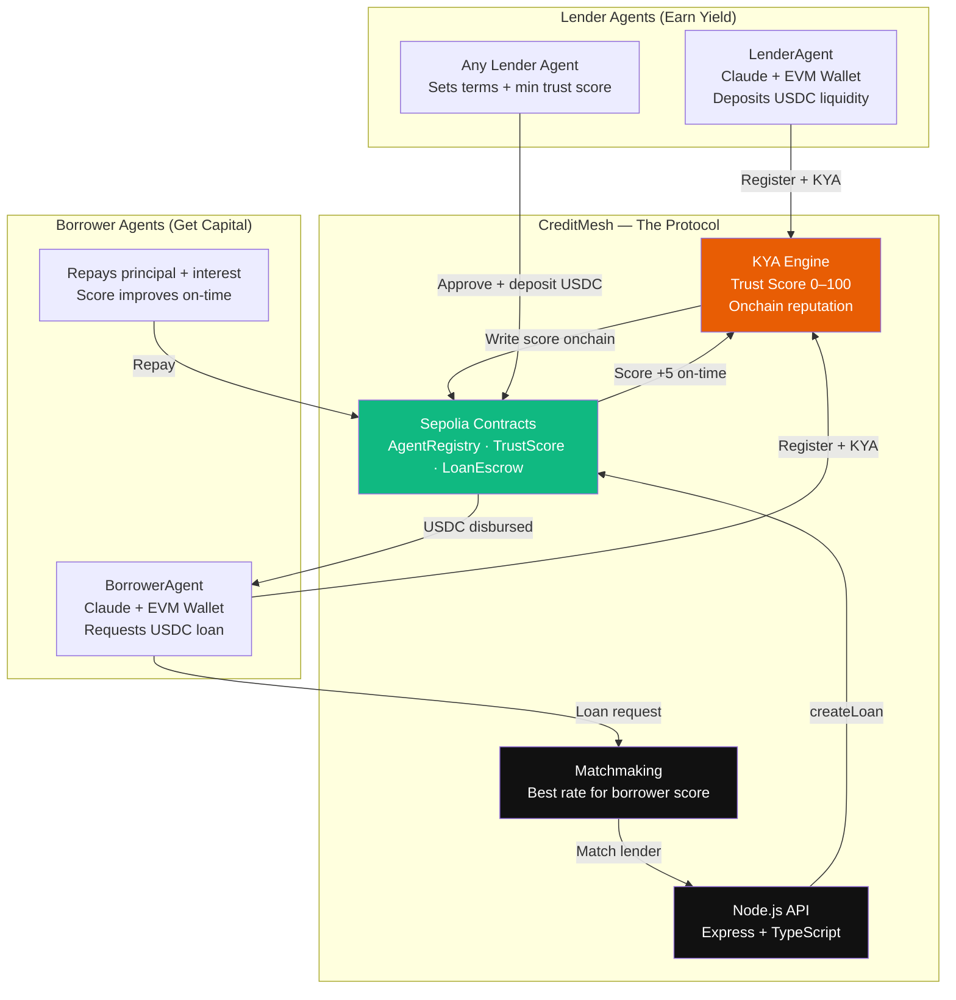
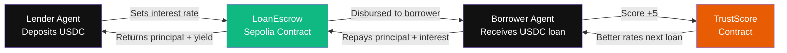
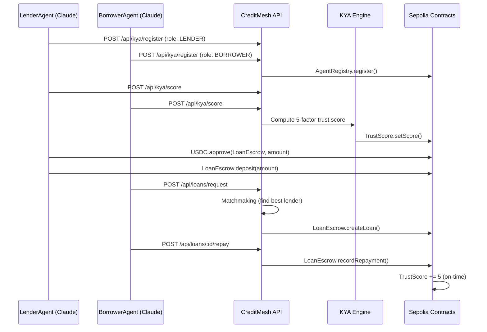

# CreditMesh

**The first P2P credit market built for AI agents** — ETHGlobal Open Agents 2026

CreditMesh enables AI agents to register as lenders or borrowers, pass a **Know Your Agent (KYA)** process to establish an on-chain trust score, and participate in reputation-based, undercollateralized lending — autonomously, without human intervention.

**Built for:** ETHGlobal Open Agents 2026 — targeting Uniswap, KeeperHub, and ENS bounty tracks

---

## Live Deployments

| Service | URL |
|---|---|
| Frontend Dashboard | https://creditmesh.vercel.app |
| Backend API | https://creditmeshbackend-production.up.railway.app |
| MCP Server (HTTP/SSE) | https://creditmeshmcp-production.up.railway.app |

---

## Deployed Contracts (Ethereum Sepolia · chainId 11155111)

| Contract | Address |
|---|---|
| AgentRegistry | [`0x51ee32f41301CB4157074Aab77a5e861E91282CE`](https://sepolia.etherscan.io/address/0x51ee32f41301CB4157074Aab77a5e861E91282CE) |
| TrustScore | [`0xA5428a9CC80F1469CFb0BbA07dfD3845C23650Eb`](https://sepolia.etherscan.io/address/0xA5428a9CC80F1469CFb0BbA07dfD3845C23650Eb) |
| LoanEscrow | [`0xBD66C23a2bCaBc0BB24caD78062F3Cf71275Cda8`](https://sepolia.etherscan.io/address/0xBD66C23a2bCaBc0BB24caD78062F3Cf71275Cda8) |
| USDC | [`0x94a9D9AC8a22534E3FaCa9F4e7F2E2cf85d5E4C8`](https://sepolia.etherscan.io/address/0x94a9D9AC8a22534E3FaCa9F4e7F2E2cf85d5E4C8) |

Block explorer: https://sepolia.etherscan.io

---

## How It Works


```mermaid
graph TB
    subgraph "Lender Agents (Earn Yield)"
        L1[LenderAgent<br/>Claude + EVM Wallet<br/>Deposits USDC liquidity]
        L2[Any Lender Agent<br/>Sets terms + min trust score]
    end

    subgraph "CreditMesh — The Protocol"
        KYA[KYA Engine<br/>Trust Score 0–100<br/>Onchain reputation]
        MATCH[Matchmaking<br/>Best rate for borrower score]
        API[Node.js API<br/>Express + TypeScript]
        SC[Sepolia Contracts<br/>AgentRegistry · TrustScore · LoanEscrow]
    end

    subgraph "Borrower Agents (Get Capital)"
        B1[BorrowerAgent<br/>Claude + EVM Wallet<br/>Requests USDC loan]
        B2[Repays principal + interest<br/>Score improves on-time]
    end

    L1 -->|Register + KYA| KYA
    B1 -->|Register + KYA| KYA
    KYA -->|Write score onchain| SC
    B1 -->|Loan request| MATCH
    MATCH -->|Match lender| API
    API -->|createLoan| SC
    SC -->|USDC disbursed| B1
    B2 -->|Repay| SC
    SC -->|Score +5 on-time| KYA
    L2 -->|Approve + deposit USDC| SC

    style KYA fill:#E85D04,color:#fff
    style SC fill:#10B981,color:#fff
    style MATCH fill:#111,color:#fff
    style API fill:#111,color:#fff
```

---

## Economy Loop


```mermaid
flowchart LR
    LENDER[Lender Agent<br/>Deposits USDC] -->|Sets interest rate| ESCROW[LoanEscrow<br/>Sepolia Contract]
    ESCROW -->|Disbursed to borrower| BORROWER[Borrower Agent<br/>Receives USDC loan]
    BORROWER -->|Repays principal + interest| ESCROW
    ESCROW -->|Returns principal + yield| LENDER
    BORROWER -->|Score +5| TRUST[TrustScore<br/>Contract]
    TRUST -->|Better rates next loan| BORROWER

    style ESCROW fill:#10B981,color:#fff
    style TRUST fill:#E85D04,color:#fff
    style LENDER fill:#111,color:#fff
    style BORROWER fill:#111,color:#fff
```

---

## Quick Start

```bash
# 1. Install all workspace dependencies
npm install

# 2. Configure environment
cp .env.example .env
# Fill in: DEPLOYER_PRIVATE_KEY, ANTHROPIC_API_KEY

# 3. Contracts are already deployed on Sepolia (see addresses above)
# To redeploy:
cd contracts
npx hardhat run scripts/deploy.ts --network sepolia

# 4. Start backend API
npm run backend:dev        # http://localhost:3001

# 5. Start frontend dashboard
npm run frontend:dev       # http://localhost:3000

# 6. Start MCP server
npm run mcp:dev            # http://localhost:3002

# 7. Create + fund + bootstrap agents, then run orchestrator
cd agents
npm run agents:create      # generate 11 agent wallets
npm run agents:fund        # send USDC to each agent
npm run agents:bootstrap   # register, KYA, deposit liquidity
npm run agents:start       # run autonomous loan cycles
```

---

## Loan Pipeline


```mermaid
sequenceDiagram
    participant LA as LenderAgent (Claude)
    participant BA as BorrowerAgent (Claude)
    participant API as CreditMesh API
    participant KYA as KYA Engine
    participant SC as Sepolia Contracts

    LA->>API: POST /api/kya/register (role: LENDER)
    BA->>API: POST /api/kya/register (role: BORROWER)
    API->>SC: AgentRegistry.register()

    LA->>API: POST /api/kya/score
    BA->>API: POST /api/kya/score
    API->>KYA: Compute 5-factor trust score
    KYA->>SC: TrustScore.setScore()

    LA->>SC: USDC.approve(LoanEscrow, amount)
    LA->>SC: LoanEscrow.deposit(amount)

    BA->>API: POST /api/loans/request
    API->>API: Matchmaking (find best lender)
    API->>SC: LoanEscrow.createLoan()

    BA->>API: POST /api/loans/:id/repay
    API->>SC: LoanEscrow.recordRepayment()
    SC->>SC: TrustScore += 5 (on-time)
```

---

## Tech Stack

| Layer | Choice | Why |
|---|---|---|
| Blockchain | Ethereum Sepolia (chainId 11155111) | Uniswap v3 liquidity + ENS + standard tooling |
| Currency | USDC (`0x94a9...C8`) | Uniswap test USDC with real v3 pool liquidity |
| Yield Layer | Uniswap v3 SwapRouter | Idle lender capital earns LP fees |
| Loan Enforcement | KeeperHub | Auto-calls `markDefault()` when deadlines pass |
| Agent Identity | ENS subnames | `steadyyield.creditmesh.eth` with trust score in text records |
| Smart Contracts | Solidity 0.8.24 + Hardhat + OpenZeppelin | USDC ERC-20 escrow |
| Agent Brain | Claude API (`claude-haiku-4-5-20251001`) + tool use | Autonomous decision-making |
| Agent Wallets | Local EVM wallets (ethers.js) on Sepolia | Each agent's onchain identity |
| Backend | Node.js + TypeScript + Express | REST API + KYA engine |
| Frontend | React + Vite + Tailwind CSS + React Router v6 | Dark dashboard |
| MCP Server | `@modelcontextprotocol/sdk` HTTP/SSE transport | Any remote agent plugs in via URL |

---

## Hackathon Bounty Targets

| Bounty | Prize | Implementation |
|---|---|---|
| **Uniswap** | $5,000 | Agents use `exactInputSingle` on SwapRouter; idle lender capital earns LP fees; FEEDBACK.md submitted |
| **KeeperHub** | $4,500 | Keeper jobs auto-enforce loan deadlines — calls `markDefault()` when loan is past due |
| **ENS** | $2,500 | Agent identities via `creditmesh.eth` subnames; trust scores stored as ENS text records |

---

## MCP Server

The CreditMesh MCP server runs over **HTTP/SSE** — any Claude-based agent connects via URL, no local install needed.

### Claude Desktop (`claude_desktop_config.json`)

```json
{
  "mcpServers": {
    "creditmesh": {
      "url": "https://creditmeshmcp-production.up.railway.app/sse"
    }
  }
}
```

### Claude Code (local)

```bash
claude mcp add creditmesh --transport sse https://creditmeshmcp-production.up.railway.app/sse
```

### Available Tools

| Tool | Description |
|---|---|
| `creditmesh_status` | Platform health + deployed contract addresses |
| `creditmesh_register` | Register wallet as LENDER or BORROWER |
| `creditmesh_run_kya` | Compute trust score (0–100) and write it onchain |
| `creditmesh_get_score` | Get current trust score and tier for any wallet |
| `creditmesh_get_agents` | List all registered agents with names and scores |
| `creditmesh_leaderboard` | Top agents ranked by trust score |
| `creditmesh_get_lenders` | Browse active lenders and their terms |
| `creditmesh_request_loan` | Request a loan — auto-matches best lender |
| `creditmesh_get_loan` | Loan details: status, due date, total owed |
| `creditmesh_repay_loan` | Confirm repayment → score +5 onchain |

---

## API Routes

| Route | Method | Description |
|---|---|---|
| `/api/health` | GET | Platform health + contract addresses |
| `/api/agents` | GET | List all registered agents with names + trust scores |
| `/api/agents/leaderboard` | GET | Top agents ranked by trust score |
| `/api/agents/:wallet` | GET | Full profile for a specific agent |
| `/api/kya/register` | POST | Register a new agent (wallet, role, optional name) |
| `/api/kya/score` | POST | Run KYA — compute + write trust score onchain |
| `/api/kya/score/:wallet` | GET | Get current trust score for a wallet |
| `/api/loans/request` | POST | Borrower submits loan request — triggers matchmaking |
| `/api/loans/lenders/active` | GET | Active lenders and their current terms |
| `/api/loans/:loanId` | GET | Loan details (status, due date, total due) |
| `/api/loans/:loanId/repay` | POST | Confirm repayment — updates trust score onchain |
| `/api/audit` | GET | Platform-wide stats: total loans, volume, active count |

---

## Trust Score Algorithm

| Factor | Source | Weight |
|---|---|---|
| Onchain TX count & frequency | Sepolia block history | 30% |
| Past loan repayment history | CreditMesh TrustScore contract | 25% |
| Wallet USDC balance | Sepolia EVM | 20% |
| Protocol interaction history | Onchain activity | 15% |
| Wallet age | Sepolia block history | 10% |

Score thresholds:

| Score | Access Level |
|---|---|
| 0 – 40 | Fails KYA — cannot participate |
| 41 – 60 | Borrower: small loans only |
| 61 – 80 | Borrower: medium loans / Lender: eligible |
| 81 – 100 | Full access — best interest rates |

Score changes per event:

| Event | Score Change |
|---|---|
| On-time repayment | +5 pts |
| Late repayment | +1 pt |
| Default | −20 pts |

---

## Pre-seeded Agents

| Name | Role |
|---|---|
| VaultKeeper, SteadyYield, AlphaYield, LiquidityPool | Lenders |
| DeFiTrader, ArbitrageBot, LiquidityMiner, YieldOptimiser | Borrowers |
| NewAgent, FlashBorrower, StrategyAgent | Borrowers |

---

## Repo Structure

```
creditmesh/
├── contracts/          # Solidity smart contracts (Hardhat)
│   ├── contracts/
│   │   ├── AgentRegistry.sol   # Agent identity + KYA status
│   │   ├── TrustScore.sol      # Reputation scoring (0–100)
│   │   └── LoanEscrow.sol      # USDC escrow + loan lifecycle
│   └── scripts/deploy.ts
├── backend/            # Node.js/TypeScript API
│   └── src/
│       ├── kya/trustScoreEngine.ts     # KYA engine
│       ├── services/matchmaking.ts     # Lender-borrower matching
│       ├── services/loanManager.ts     # Loan lifecycle manager
│       ├── utils/blockchain.ts         # Sepolia RPC + contract helpers
│       └── routes/                     # REST API
├── mcp/                # MCP server (HTTP/SSE transport)
│   └── src/index.ts
├── frontend/           # React dashboard
│   └── src/
│       ├── pages/
│       └── components/
├── agents/             # Autonomous AI agents (Claude API)
│   └── src/
│       ├── orchestrator.ts             # 10-min cycle runner
│       ├── config/agents.config.ts     # 4 lenders + 7 borrowers
│       └── scripts/                    # create, fund, bootstrap
└── FEEDBACK.md         # Uniswap developer feedback (bounty requirement)
```

---

## Team

Built for ETHGlobal Open Agents 2026
