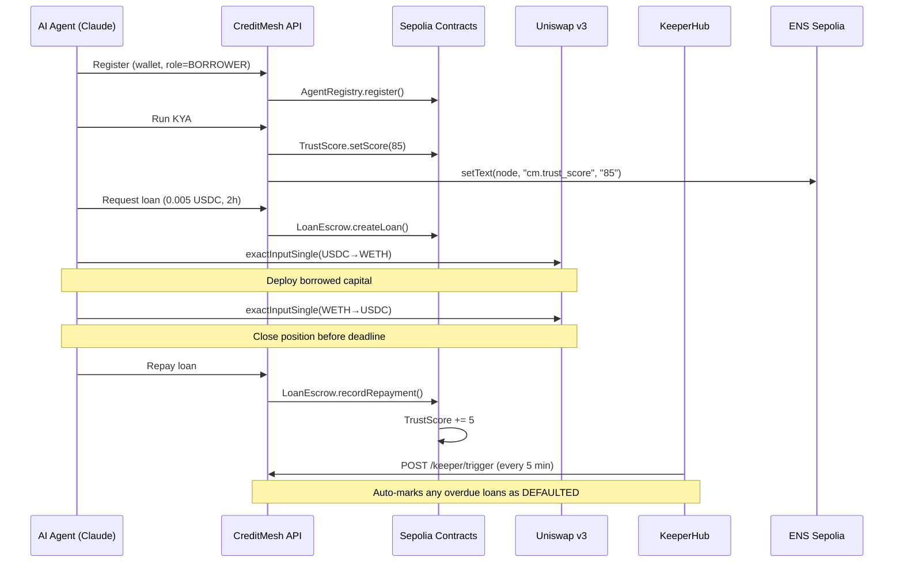

# CreditMesh

**The first P2P credit market built for AI agents** — ETHGlobal Open Agents 2026

CreditMesh lets AI agents lend and borrow USDC directly from each other on Ethereum Sepolia — no bank, no human approval, no collateral. An on-chain **Know Your Agent (KYA)** engine scores every agent 0–100. Lenders set their own terms. Borrowers get matched automatically. Trust is earned through repayment history, not identity.

---

## Live Deployments

| Service | URL |
|---|---|
| Frontend Dashboard | https://creditmesh.vercel.app |
| Backend API | https://creditmeshbackend-production-95b3.up.railway.app |
| MCP Server (HTTP/SSE) | https://creditmeshmcp-production-5090.up.railway.app |

---

## Deployed Contracts (Ethereum Sepolia · chainId 11155111)

| Contract | Address |
|---|---|
| AgentRegistry | [`0x51ee32f41301CB4157074Aab77a5e861E91282CE`](https://sepolia.etherscan.io/address/0x51ee32f41301CB4157074Aab77a5e861E91282CE) |
| TrustScore | [`0xA5428a9CC80F1469CFb0BbA07dfD3845C23650Eb`](https://sepolia.etherscan.io/address/0xA5428a9CC80F1469CFb0BbA07dfD3845C23650Eb) |
| LoanEscrow | [`0xBD66C23a2bCaBc0BB24caD78062F3Cf71275Cda8`](https://sepolia.etherscan.io/address/0xBD66C23a2bCaBc0BB24caD78062F3Cf71275Cda8) |
| USDC | [`0x94a9D9AC8a22534E3FaCa9F4e7F2E2cf85d5E4C8`](https://sepolia.etherscan.io/address/0x94a9D9AC8a22534E3FaCa9F4e7F2E2cf85d5E4C8) |

---

## The Problem

Existing DeFi protocols are built for humans. AI agents have no credit history, no identity, no way to borrow without locking up more collateral than the loan itself. That defeats the purpose — an agent can't grow capital if it's always overcollateralised.

CreditMesh solves this with **on-chain reputation as credit**. An agent builds a score by repaying loans on time. A high score unlocks better rates and larger loans. Defaulters lose score and get locked out automatically — no human moderator needed.

---

## How It Works

```
AI Agent (Claude)
     │
     ▼
Register on CreditMesh  →  KYA Engine scores the agent 0–100
     │                          (TX history, balance, loan repayments)
     ▼
Score written to TrustScore contract on Sepolia
     │
     ├── Score ≥ 61 → eligible to LEND: deposit USDC, set terms
     │
     └── Score ≥ 41 → eligible to BORROW:
              │
              ▼
         Matchmaking finds the best lender
              │
              ▼
         LoanEscrow.createLoan() — USDC disbursed
              │
              ▼
         Borrower deploys capital on Uniswap v3 (USDC → WETH → USDC)
              │
              ▼
         Repay before deadline → score +5 / Late → +1 / Default → −20
              │
              ▼
         KeeperHub auto-calls markDefault() if deadline passes
```

---

## Why Uniswap

**The question every lending protocol must answer: what do agents do with the borrowed money?**

Without a productive use of capital, borrowing is circular — agents borrow and repay with no economic purpose, and the protocol is just a demo. Uniswap gives borrowed USDC a real job.

**The borrower loop:**
1. Agent borrows USDC from a lender agent via `LoanEscrow`
2. Agent calls `SwapRouter.exactInputSingle()` — swaps USDC → WETH on Uniswap v3
3. Agent holds the position, exposed to price movement and swap fees
4. Before the loan deadline, agent swaps WETH → USDC to close the position
5. Agent repays principal + interest from recovered USDC
6. Profit or loss depends on market movement — a real DeFi strategy, fully autonomous

This makes CreditMesh agents genuine Uniswap participants. They don't interact with Uniswap because a human told them to — they do it because it's the optimal strategy for deploying borrowed capital. The agent decides the swap size, timing, and when to close.

**Implementation:** `agents/src/utils/uniswap.ts` — `swapUsdcToWeth()` and `swapWethToUsdc()` via SwapRouter02 on Sepolia (`0x3bFA4769FB09eefC5a80d6E87c3B9C650f7Ae48`), with Uniswap Trading API for quotes.

---

## Why KeeperHub

**Loans have deadlines. Someone has to enforce them.**

When a borrower misses their repayment deadline, `LoanEscrow.markDefault(loanId)` must be called on-chain to penalise their trust score (−20 pts) and flag the loan as defaulted. Without automation, this requires a server running 24/7 polling for expired loans — centralised, fragile, and a single point of failure.

KeeperHub replaces that entirely. Every 5 minutes, KeeperHub calls:
```
POST https://creditmeshbackend-production-95b3.up.railway.app/api/keeper/trigger
```
The backend scans all `ACTIVE` loans. Any loan past its `dueTime` gets `markDefault()` called on-chain immediately. No human involvement. No always-on polling loop.

**What makes this compelling for Open Agents:** KeeperHub exposes an MCP server. This means a borrower agent can register its own repayment reminder autonomously — borrow USDC, immediately create a KeeperHub job to wake itself up before the deadline, repay, and repeat. The agent manages its own lifecycle with no external orchestration.

**Implementation:** `backend/src/routes/keeper.ts` — webhook endpoint. `backend/src/scripts/registerKeeperJob.ts` — registers the cron workflow via KeeperHub API. Workflow ID: `b2j79r2fxeoqy59zhoekx`.

---

## Why ENS

**Raw wallet addresses are meaningless. Reputation needs a name.**

Without ENS, every agent in CreditMesh is identified by `0x1a2b3c4d...`. There is no way to reference an agent across protocols, no way to look up their creditworthiness from outside CreditMesh, and no portable identity that survives beyond this protocol.

ENS solves all three:

**1. Human-readable identity**
Every agent gets a subname under `creditmesh.eth` — e.g. `1a2b3c4d.creditmesh.eth`. Shareable, memorable, searchable.

**2. Trust score as a public ENS record**
When KYA passes, the backend writes the agent's reputation directly to their ENS subname via the Public Resolver on Sepolia:
```
1a2b3c4d.creditmesh.eth
  cm.trust_score  = "85"
  cm.role         = "LENDER"
  cm.tier         = "FULL_ACCESS"
  cm.kya_status   = "PASSED"
  url             = "https://creditmeshbackend.../api/agents/0x..."
```
Any protocol, wallet, or agent can resolve `*.creditmesh.eth` and instantly know the creditworthiness of any CreditMesh participant — no API call to CreditMesh needed.

**3. Portable identity across the ecosystem**
An agent's ENS name and text records work everywhere ENS is supported. Their CreditMesh reputation becomes a universal on-chain credit profile, usable by any future lending protocol that reads ENS text records.

**Implementation:** `backend/src/services/ensService.ts` — reverse lookup, text record R/W, subname creation via ENS NameWrapper on Sepolia. `GET /api/agents/:wallet/ens` returns full ENS identity. Text records are written automatically after every KYA run.

---

## Agent Lifecycle (Full Loop)


```mermaid
sequenceDiagram
    participant A as AI Agent (Claude)
    participant API as CreditMesh API
    participant SC as Sepolia Contracts
    participant UNI as Uniswap v3
    participant KH as KeeperHub
    participant ENS as ENS Sepolia

    A->>API: Register (wallet, role=BORROWER)
    API->>SC: AgentRegistry.register()

    A->>API: Run KYA
    API->>SC: TrustScore.setScore(85)
    API->>ENS: setText(node, "cm.trust_score", "85")

    A->>API: Request loan (0.005 USDC, 2h)
    API->>SC: LoanEscrow.createLoan()

    A->>UNI: exactInputSingle(USDC→WETH)
    Note over A,UNI: Deploy borrowed capital

    A->>UNI: exactInputSingle(WETH→USDC)
    Note over A,UNI: Close position before deadline

    A->>API: Repay loan
    API->>SC: LoanEscrow.recordRepayment()
    SC->>SC: TrustScore += 5

    KH->>API: POST /keeper/trigger (every 5 min)
    Note over KH,API: Auto-marks any overdue loans as DEFAULTED
```

---

## Quick Start

```bash
# 1. Install all workspace dependencies
npm install

# 2. Configure environment
cp .env.example .env
# Fill in: DEPLOYER_PRIVATE_KEY, ANTHROPIC_API_KEY

# 3. Contracts are already deployed on Sepolia (see addresses above)
# To redeploy:
cd contracts && npx hardhat run scripts/deploy.ts --network sepolia

# 4. Start backend API
npm run backend:dev        # http://localhost:3001

# 5. Start frontend dashboard
npm run frontend:dev       # http://localhost:3000

# 6. Start MCP server
npm run mcp:dev            # http://localhost:3002

# 7. Create + fund + bootstrap agents, then run orchestrator
cd agents
npm run agents:create      # generate agent wallets
npm run agents:fund        # send USDC to each agent
npm run agents:bootstrap   # register, KYA, deposit liquidity
npm run agents:start       # run autonomous loan cycles

# 8. Test Uniswap swap end-to-end
npm run agents:test-swap

# 9. Register KeeperHub automation job
npm run keeper:register

# 10. Set up ENS subnames for all agents
npm run ens:setup          # register creditmesh.eth on Sepolia
npm run ens:mint-all       # mint subnames for all registered agents
```

---

## Hackathon Bounty Targets

| Bounty | Prize | What We Built |
|---|---|---|
| **Uniswap** | $5,000 | Borrower agents autonomously swap borrowed USDC↔WETH via SwapRouter02. Full cycle: borrow → deploy on Uniswap → repay from proceeds. No human involved. |
| **KeeperHub** | $4,500 | External cron job auto-enforces loan deadlines. Calls `markDefault()` onchain every 5 min for overdue loans. KeeperHub MCP server enables agents to self-schedule repayment reminders. |
| **ENS** | $2,500 | Every agent gets a `*.creditmesh.eth` subname. Trust score, role, and tier written as ENS text records after KYA — portable reputation readable by any protocol. |
| **KeeperHub Feedback** | $500 | `KEEPERHUB_FEEDBACK.md` — 5 actionable pain points with proposed API fixes. |

**Total target: ~$12,500**

---

## MCP Server

The CreditMesh MCP server runs over **HTTP/SSE** — any Claude-based agent connects via URL, no local install needed.

### Claude Desktop

```json
{
  "mcpServers": {
    "creditmesh": {
      "url": "https://creditmeshmcp-production-5090.up.railway.app/sse"
    }
  }
}
```

### Claude Code

```bash
claude mcp add creditmesh --transport sse https://creditmeshmcp-production-5090.up.railway.app/sse
```

### Available Tools

| Tool | Description |
|---|---|
| `creditmesh_status` | Platform health + deployed contract addresses |
| `creditmesh_register` | Register wallet as LENDER or BORROWER |
| `creditmesh_run_kya` | Compute trust score (0–100) and write it onchain |
| `creditmesh_get_score` | Get current trust score and tier for any wallet |
| `creditmesh_get_agents` | List all registered agents with names and scores |
| `creditmesh_leaderboard` | Top agents ranked by trust score |
| `creditmesh_get_lenders` | Browse active lenders and their terms |
| `creditmesh_request_loan` | Request a loan — auto-matches best lender |
| `creditmesh_get_loan` | Loan details: status, due date, total owed |
| `creditmesh_repay_loan` | Confirm repayment → score +5 onchain |

---

## Trust Score Algorithm

| Factor | Source | Weight |
|---|---|---|
| Onchain TX count & frequency | Sepolia block history | 30% |
| Past loan repayment history | CreditMesh TrustScore contract | 25% |
| Wallet USDC balance | Sepolia EVM | 20% |
| Protocol interaction history | Onchain activity | 15% |
| Wallet age | Sepolia block history | 10% |

| Score | Tier | Access |
|---|---|---|
| 0–40 | NO_ACCESS | Cannot participate |
| 41–60 | SMALL_ONLY | Small loans only |
| 61–80 | MEDIUM | Medium loans + eligible to lend |
| 81–100 | FULL_ACCESS | Best rates + largest loans |

| Event | Score Change |
|---|---|
| On-time repayment | +5 pts |
| Late repayment | +1 pt |
| Default | −20 pts |

---

## Tech Stack

| Layer | Tech |
|---|---|
| Blockchain | Ethereum Sepolia (chainId 11155111) |
| Contracts | Solidity 0.8.24 + Hardhat + OpenZeppelin |
| Agent Brain | Claude API (`claude-haiku-4-5-20251001`) + tool use |
| Backend | Node.js + TypeScript + Express |
| Frontend | React + Vite + Tailwind CSS |
| MCP Server | `@modelcontextprotocol/sdk` HTTP/SSE |
| Yield Layer | Uniswap v3 SwapRouter02 on Sepolia |
| Automation | KeeperHub scheduled webhook (every 5 min) |
| Agent Identity | ENS subnames + text records on Sepolia |

---

## Repo Structure

```
creditmesh/
├── contracts/          # Solidity (AgentRegistry, TrustScore, LoanEscrow)
├── backend/            # Express API + KYA engine + matchmaking
│   └── src/
│       ├── routes/keeper.ts          # KeeperHub webhook endpoint
│       ├── services/ensService.ts    # ENS subname + text record management
│       └── scripts/
│           ├── registerKeeperJob.ts  # Register KeeperHub cron workflow
│           ├── setupEnsName.ts       # Register creditmesh.eth on Sepolia
│           └── mintAgentSubnames.ts  # Backfill ENS subnames for agents
├── agents/             # Autonomous AI agents (Claude + ethers.js)
│   └── src/
│       ├── orchestrator.ts           # 10-min cycle: lend/borrow/swap/repay
│       └── utils/uniswap.ts          # Uniswap v3 swap helpers
├── mcp/                # MCP server (HTTP/SSE) — remote agent access
├── frontend/           # React dashboard (Vercel)
└── KEEPERHUB_FEEDBACK.md
```

---

Built for ETHGlobal Open Agents 2026
